# Olist E-Commerce — End-to-End Data Engineering Pipeline

Pipeline de datos construido sobre el dataset público de Olist (Brazilian E-Commerce).  
Cubre desde la extracción cruda hasta dashboards interactivos en Power BI, siguiendo estándares de producción reales.

---

## Objetivo del Proyecto

Olist es el marketplace de e-commerce más grande de Brasil. Con ~100,000 órdenes reales entre 2016 y 2018, el negocio necesita responder preguntas críticas sobre **revenue, logística y satisfacción del cliente** para tomar decisiones informadas.

Este proyecto construye la infraestructura de datos completa: desde la extracción cruda del dataset hasta un modelo dimensional en la nube, exponiendo vistas SQL avanzadas listas para consumo en Power BI.

---

## Dataset

[Brazilian E-Commerce Public Dataset by Olist](https://www.kaggle.com/datasets/olistbr/brazilian-ecommerce)  
~100k órdenes reales entre 2016 y 2018, anonimizadas. 9 tablas relacionales.

---

## Arquitectura del Pipeline

```mermaid
flowchart LR
    A["🗂️ Kaggle API\nCSV crudo ~45MB"] -->|boto3 + SSE-AES256| B[("☁️ AWS S3\nBronze Layer")]
    B -->|aws_s3 extension\ncarga nativa| C[("🐘 Aurora\nschema: staging")]
    C -->|SQL ETL\ntype casting + NULLIF| D[("⭐ Aurora\nschema: dwh")]
    D -->|"Phase 4: CTEs + Window Functions\nPhase 5: PL/pgSQL Stored Procs"| E[("📐 Aurora\nschema: reporting")]
    E -->|DirectQuery| F["📊 Power BI\nDAX + Dashboards"]

    style A fill:#f5a623,color:#000
    style B fill:#e8832a,color:#fff
    style C fill:#c0392b,color:#fff
    style D fill:#27ae60,color:#fff
    style E fill:#2980b9,color:#fff
    style F fill:#8e44ad,color:#fff
```

---

## Arquitectura Medallion

El pipeline implementa la arquitectura **Medallion** (estándar usado por Databricks, Airbnb y Netflix):

| Capa | Ubicación | Descripción |
|---|---|---|
| **Bronze** | AWS S3 `bronze/olist/` | Datos crudos exactamente como vienen de Kaggle. Nunca se modifican. Son el respaldo absoluto. |
| **Silver** | Aurora `schema: staging` | Copia fiel en base de datos, todo en tipo `TEXT`. Sin transformaciones — permite detectar errores antes de procesarlos. |
| **Gold** | Aurora `schema: dwh` | Modelo estrella limpio, con tipos correctos, listo para consumo de negocio. |
| **BI** | Aurora `schema: reporting` | Vistas SQL con lógica de negocio pre-calculada. Power BI solo visualiza. |

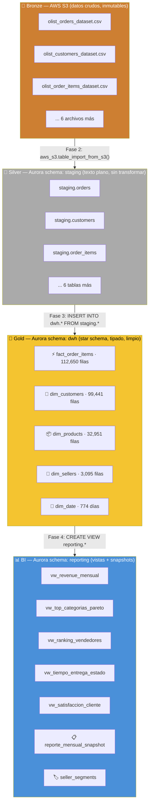

---

## De Kaggle a S3 Bronze — Extracción Segura (Phase 1)

La primera transformación convierte datos públicos de Kaggle en datos cifrados y versionados en la nube. El proceso completo ocurre en **3 funciones Python modulares** ejecutadas en secuencia:

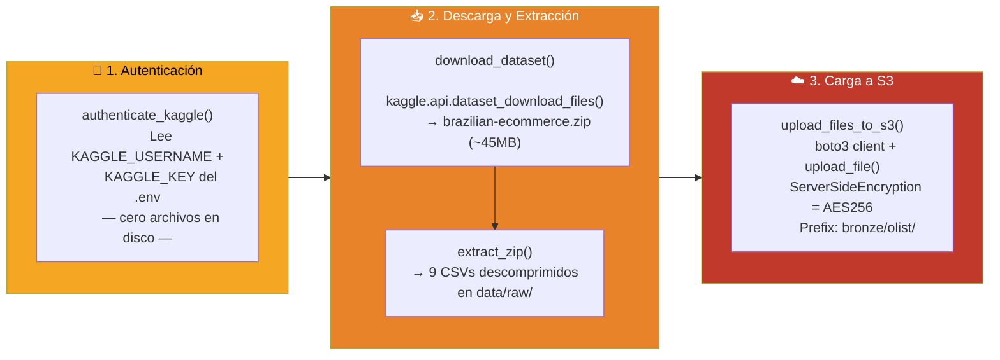

### Los 9 archivos cargados a la capa Bronze

| Archivo en S3 `bronze/olist/` | Entidad | Filas |
|-------------------------------|---------|-------|
| `olist_orders_dataset.csv` | Pedidos maestros (estado, fechas) | 99,441 |
| `olist_customers_dataset.csv` | Clientes (ciudad, estado) | 99,441 |
| `olist_order_items_dataset.csv` | Ítems dentro de cada pedido | 112,650 |
| `olist_order_payments_dataset.csv` | Pagos (tipo, cuotas, valor) | 103,886 |
| `olist_order_reviews_dataset.csv` | Reseñas y puntuaciones | 99,224 |
| `olist_products_dataset.csv` | Catálogo de productos | 32,951 |
| `olist_sellers_dataset.csv` | Vendedores registrados | 3,095 |
| `olist_geolocation_dataset.csv` | Coordenadas por código postal | 1,000,163 |
| `product_category_name_translation.csv` | Traducción ES→EN de categorías | 71 |

### Decisiones de seguridad

| Decisión | Implementación | Razonamiento |
|----------|---------------|-------------|
| Sin token Kaggle en disco | `os.environ["KAGGLE_USERNAME"] = cfg.username` (en memoria) | Evita que `~/.kaggle/kaggle.json` quede accesible en ambientes compartidos o CI |
| Cifrado en S3 | `ExtraArgs={"ServerSideEncryption": "AES256"}` | Los datos contienen información de clientes (ciudades, estados) protegida en reposo |
| Credenciales AWS temporales | `aws_session_token` leído del `.env` | AWS Academy rota tokens cada 4h; el config lee siempre de `.env` sin hardcodear |
| `.gitignore` para `data/raw/` | 9 CSVs nunca llegan al repositorio | Los archivos de Kaggle son datos de terceros — el repo solo guarda el código |

---

## Modelo Estrella (Star Schema)

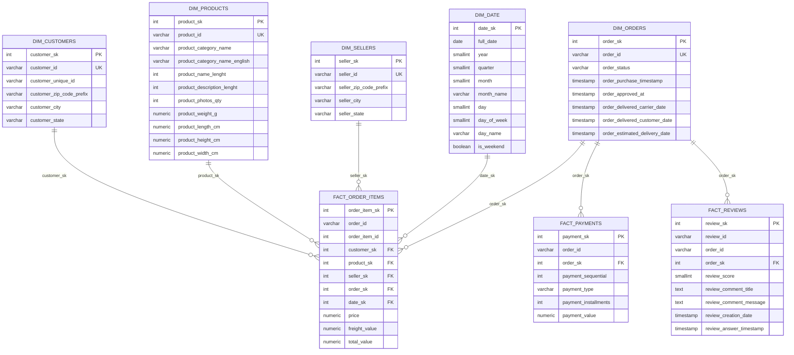

### Tablas de Hechos

| Tabla | Grain | FK a dim_orders | Métricas |
|---|---|---|---|
| `fact_order_items` | 1 fila por ítem de pedido | `order_sk` (surrogate) | `price`, `freight_value`, `total_value` |
| `fact_payments` | 1 fila por pago | `order_sk` (surrogate) + `order_id` (natural, para trazabilidad) | `payment_value`, `payment_installments` |
| `fact_reviews` | 1 fila por reseña | `order_sk` (surrogate) + `order_id` (natural, para trazabilidad) | `review_score` |

### Tablas de Dimensiones

| Tabla | Describe | Filas |
|---|---|---|
| `dim_customers` | Quién compró | 99,441 |
| `dim_products` | Qué se vendió (con categoría en inglés) | 32,951 |
| `dim_sellers` | Quién vendió | 3,095 |
| `dim_orders` | Estado y fechas del pedido | 99,441 |
| `dim_date` | Calendario derivado de los timestamps | 774 días |

---

## De Staging a DWH — Cómo se Construyeron las Dimensiones y Facts (Phase 3)

El mayor salto técnico del proyecto: las 9 tablas de texto plano en `staging` se transforman en un modelo estrella completamente tipado en `dwh`. Todo el proceso ocurre **en SQL puro**, en 4 scripts ejecutados en orden.

### Qué tabla staging alimenta cada tabla en el DWH

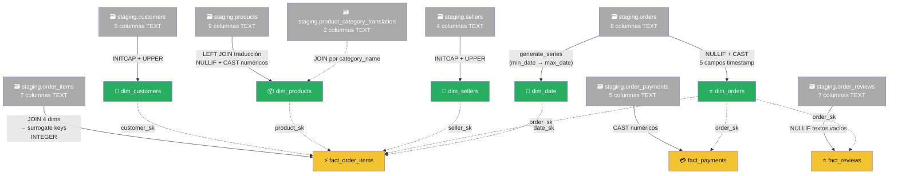

### Transformaciones clave por tabla

| Tabla destino | Fuente principal | Transformación más importante |
|---------------|-----------------|-------------------------------|
| `dim_date` | `staging.orders` | `generate_series(MIN(fecha), MAX(fecha), '1 day')` — genera 774 fechas del calendario sin huecos |
| `dim_customers` | `staging.customers` | `INITCAP(customer_city)` y `UPPER(customer_state)` — normaliza capitalización inconsistente del CSV |
| `dim_products` | `staging.products` + translation | `LEFT JOIN` para categoría en inglés; `NULLIF(col,'')::NUMERIC` para peso y dimensiones |
| `dim_sellers` | `staging.sellers` | Igual que customers: `INITCAP` + `UPPER` |
| `dim_orders` | `staging.orders` | `NULLIF(col,'')::TIMESTAMP` en las **5 columnas de fecha** — el patrón más crítico |
| `fact_order_items` | `staging.order_items` | `JOIN` a 4 dimensiones para reemplazar IDs de texto por surrogate keys INTEGER |
| `fact_payments` | `staging.order_payments` | `LEFT JOIN dim_orders ON order_id` para obtener `order_sk`; `CAST` numéricos en valor e installments |
| `fact_reviews` | `staging.order_reviews` | `LEFT JOIN dim_orders ON order_id` para obtener `order_sk`; `NULLIF` en comentarios vacíos |

### Por qué el patrón `NULLIF(col, '')` es la clave del ETL

Los CSVs de Kaggle usan cadena vacía `""` donde debería haber `NULL`. Si se hace el cast directamente, PostgreSQL lanza error:

```sql
-- ❌ Sin NULLIF: falla si el CSV tiene campo vacío
CAST('' AS TIMESTAMP)   -- ERROR: invalid input syntax for type timestamp

-- ✅ Con NULLIF: convierte '' a NULL antes de castear
NULLIF(order_delivered_customer_date, '')::TIMESTAMP  -- → NULL (sin error)
```

Este patrón protege las **5 columnas de fecha** de `dim_orders` y todas las **dimensiones físicas** de `dim_products` (peso, largo, alto, ancho). Sin él, cualquier orden con fecha de entrega vacía cortaría el proceso completo.

### Por qué `dim_date` se genera y no se copia de staging

```sql
-- Genera una fila por cada día del período completo
SELECT generate_series(
    MIN(order_purchase_timestamp::DATE),
    MAX(order_purchase_timestamp::DATE),
    INTERVAL '1 day'
)::DATE AS full_date
FROM staging.orders
WHERE order_purchase_timestamp <> '';
-- Resultado: 774 fechas continuas (Sep 2016 → Sep 2018)
```

Si se copiaran las fechas directamente de `staging.orders`, solo existirían los días con ventas. Los días sin ventas quedarían sin fila en la dimensión, imposibilitando análisis de **días de inactividad** o **gaps en el negocio**. Con `generate_series` el calendario está siempre completo.

---

## Decisiones de Diseño Justificadas

### 1. Surrogate Keys (`_sk`) en vez de Natural Keys

Cada dimensión usa un `SERIAL` como PK en lugar del ID original de Kaggle:

```sql
dim_customers.customer_sk  SERIAL PRIMARY KEY   -- eficiente en JOINs
dim_customers.customer_id  VARCHAR              -- conservado para trazabilidad
```

**Por qué:** Los JOINs entre INTEGER son hasta 3x más rápidos que entre VARCHAR en tablas de millones de filas.

### 2. Staging con tipos TEXT

```sql
-- staging: todo TEXT (carga sin riesgo de error)
price TEXT  →  "150.50"

-- dwh: tipo correcto tras limpieza
price NUMERIC(10,2)  →  150.50
```

**Por qué:** Los CSVs contienen valores vacíos, comas como separadores decimales y encoding inconsistente. Cargar como TEXT primero permite detectar y limpiar errores en SQL antes de castear.

### 3. `fact_payments` y `fact_reviews`: FK formal via surrogate key

Ambas tablas incluyen `order_sk INTEGER REFERENCES dwh.dim_orders(order_sk)` **y** conservan `order_id` (clave natural, VARCHAR) para trazabilidad:

```sql
order_id  VARCHAR(32) NOT NULL,                              -- natural key: trazabilidad y debugging
order_sk  INTEGER     REFERENCES dwh.dim_orders(order_sk)   -- surrogate key: FK formal al modelo estrella
```

#### ¿Cómo sabe el ETL qué número `order_sk` corresponde a cada pago?

El `order_sk` es un `SERIAL` (1, 2, 3…) asignado automáticamente por PostgreSQL al poblar `dim_orders`. No se adivina — se **busca** en el ETL usando `order_id` como puente:

```sql
-- El ETL hace un JOIN para copiar el order_sk que dim_orders ya asignó:
INSERT INTO dwh.fact_payments (order_id, order_sk, ...)
SELECT
    pay.order_id,
    dor.order_sk,   -- ← viene de dim_orders: 'abc123' → order_sk = 42
    ...
FROM staging.order_payments pay
LEFT JOIN dwh.dim_orders dor ON pay.order_id = dor.order_id;
```

El resultado es que `fact_payments.order_sk = 42` y `dim_orders.order_sk = 42` apuntan **al mismo pedido** porque el número 42 fue copiado de `dim_orders`, no generado independientemente. El `order_id` se conserva en ambas tablas como verificación: si `fact_payments.order_id = dim_orders.order_id` para todo `order_sk` que coincida, la integridad está garantizada.

```sql
-- Test de integridad: debe retornar 0
SELECT COUNT(*)
FROM dwh.fact_payments fp
JOIN dwh.dim_orders dor ON fp.order_sk = dor.order_sk
WHERE fp.order_id <> dor.order_id;
```

El uso de `LEFT JOIN` (en lugar de `INNER JOIN`) preserva pagos o reseñas cuyos pedidos no existan en `dim_orders` — quedan con `order_sk = NULL` en lugar de descartarse silenciosamente.

### 4. Schema `reporting` separado del DWH

El DWH nunca se modifica para BI. En vez de queries directos en Power BI o modificar las fact tables, se crea un schema `reporting` con vistas SQL:

```sql
-- reporting.vw_revenue_mensual consume dwh sin tocarlo
CREATE VIEW reporting.vw_revenue_mensual AS
SELECT ... FROM dwh.fact_order_items JOIN dwh.dim_date ...
```

**Por qué:** La lógica de negocio queda versionada en Git, reutilizable por cualquier herramienta de BI, y el DWH permanece como fuente de verdad única.

---

## Preguntas de Negocio y Análisis

Con el modelo estrella construido y las vistas en `reporting`, el pipeline responde 5 preguntas accionables:

---

### P1 — ¿Cómo evolucionó el revenue mes a mes y cuánto creció?

**Por qué importa:** Detectar estacionalidad, meses de caída y tendencia general del negocio.

**Tablas involucradas:**
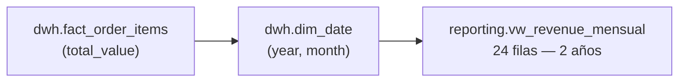

**SQL** — `CTE` + `LAG()`:
```sql
WITH monthly AS (
    SELECT dd.year, dd.month, dd.month_name,
           SUM(f.total_value) AS revenue
    FROM dwh.fact_order_items f
    JOIN dwh.dim_date dd ON f.date_sk = dd.date_sk
    GROUP BY dd.year, dd.month, dd.month_name
)
SELECT year, month_name, ROUND(revenue, 2),
       ROUND(
           (revenue - LAG(revenue) OVER (ORDER BY year, month))
           / NULLIF(LAG(revenue) OVER (ORDER BY year, month), 0) * 100
       , 2) AS crecimiento_pct
FROM monthly ORDER BY year, month;
```

**Columnas de `reporting.vw_revenue_mensual`:**

| Columna | Tipo | Descripción |
|---|---|---|
| `year` | SMALLINT | Año del período |
| `month` | SMALLINT | Número de mes (1–12) |
| `month_name` | VARCHAR | Nombre del mes en inglés |
| `revenue` | NUMERIC | Revenue total del mes (BRL) |
| `total_ordenes` | BIGINT | Cantidad de órdenes únicas en el mes |
| `ticket_promedio` | NUMERIC | Revenue promedio por ítem |
| `revenue_mes_anterior` | NUMERIC | Revenue del mes previo (calculado con `LAG()`) |
| `crecimiento_pct` | NUMERIC | Variación MoM en % — positivo = crecimiento |

**Visual:** Gráfico de línea + columna combinado (revenue por mes / % crecimiento).

**Ver en el Dashboard:** [Página 1 — Executive Summary](#página-1--executive-summary) · Gráficos "Revenue Mensual" y "Crecimiento Mensual"

<details>
<summary>📊 Datos reales — <code>reporting.vw_revenue_mensual</code> (20 filas con datos completos · Ene 2017 – Ago 2018)</summary>

| Año  | Mes       | Revenue (BRL)      | Órdenes | Ticket Prom. | Crec. MoM   |
|------|-----------|-------------------|---------|-------------|-------------|
| 2017 | January   | 137,188.49        | 789     | 143.65      | —           |
| 2017 | February  | 286,280.62        | 1,733   | 146.74      | +108.68%    |
| 2017 | March     | 432,048.59        | 2,641   | 144.02      | +50.92%     |
| 2017 | April     | 412,422.24        | 2,391   | 153.66      | -4.54%      |
| 2017 | May       | 586,190.95        | 3,660   | 141.73      | +42.13%     |
| 2017 | June      | 502,963.04        | 3,217   | 140.37      | -14.20%     |
| 2017 | July      | 584,971.62        | 3,969   | 129.45      | +16.31%     |
| 2017 | August    | 668,204.60        | 4,293   | 136.09      | +14.23%     |
| 2017 | September | 720,398.91        | 4,243   | 149.12      | +7.81%      |
| 2017 | October   | 769,312.37        | 4,568   | 144.55      | +6.79%      |
| 2017 | November  | **1,179,143.77**  | **7,451** | 136.08   | **+53.27%** |
| 2017 | December  | 863,547.23        | 5,624   | 136.90      | -26.76%     |
| 2018 | January   | 1,107,301.89      | 7,220   | 134.91      | +28.23%     |
| 2018 | February  | 986,908.96        | 6,694   | 128.64      | -10.87%     |
| 2018 | March     | 1,155,126.82      | 7,188   | 140.58      | +17.04%     |
| 2018 | April     | 1,159,698.04      | 6,934   | 145.42      | +0.40%      |
| 2018 | May       | 1,149,781.82      | 6,853   | 145.08      | -0.86%      |
| 2018 | June      | 1,022,677.11      | 6,160   | 144.49      | -11.05%     |
| 2018 | July      | 1,058,728.03      | 6,273   | 149.28      | +3.53%      |
| 2018 | August    | 1,003,308.47      | 6,452   | 138.43      | -5.23%      |

> El pico de **noviembre 2017** (+53.27% MoM, R$1.17M) corresponde a Black Friday Brasil. Vista completa: 24 filas incluyendo meses parciales de inicio/fin del dataset.

</details>

---

### P2 — ¿Qué categorías de productos generan el 80% del revenue? (Pareto)

**Por qué importa:** El principio 80/20 permite enfocar el catálogo y la inversión de marketing en las categorías más rentables.

**Tablas involucradas:**
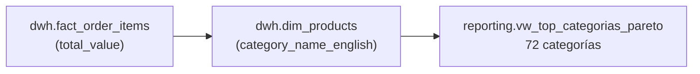

**SQL** — `CTE` + `SUM() OVER()` acumulado:
```sql
WITH revenue_cat AS (
    SELECT dp.product_category_name_english AS categoria,
           SUM(f.total_value) AS revenue
    FROM dwh.fact_order_items f
    JOIN dwh.dim_products dp ON f.product_sk = dp.product_sk
    GROUP BY dp.product_category_name_english
),
total AS (SELECT SUM(revenue) AS total_revenue FROM revenue_cat)
SELECT categoria, ROUND(revenue, 2),
       ROUND(SUM(revenue) OVER (ORDER BY revenue DESC) / total_revenue * 100, 2) AS pct_acumulado,
       RANK() OVER (ORDER BY revenue DESC) AS ranking
FROM revenue_cat, total ORDER BY revenue DESC;
```

**Columnas de `reporting.vw_top_categorias_pareto`:**

| Columna | Tipo | Descripción |
|---|---|---|
| `categoria` | VARCHAR | Nombre de la categoría en inglés (o `'Sin categoría'`) |
| `revenue` | NUMERIC | Revenue total de la categoría (BRL) |
| `total_items` | BIGINT | Cantidad de ítems vendidos en la categoría |
| `pct_del_total` | NUMERIC | Porcentaje sobre el revenue total del catálogo |
| `pct_acumulado` | NUMERIC | Porcentaje acumulado ordenado de mayor a menor revenue — la curva de Pareto |
| `ranking` | BIGINT | Posición de la categoría por revenue (`RANK()`) |
| `segmento_pareto` | VARCHAR | `'Top 80%'` si está en el 80% del revenue acumulado · `'Restante 20%'` si no |

**Visual:** Gráfico de barras + línea de Pareto acumulada.

**Ver en el Dashboard:** [Página 1](#página-1--executive-summary) · Barras "Top Categorías" — [Página 2](#página-2--análisis-de-vendedores-y-categorías) · Curva "Pareto de Categorías por Revenue"

<details>
<summary>📊 Datos reales — <code>reporting.vw_top_categorias_pareto</code> (top 15 de 72 categorías)</summary>

| Ranking | Categoría               | Revenue (BRL)    | % del Total | % Acumulado | Segmento     |
|---------|------------------------|-----------------|-------------|-------------|--------------|
| 1       | health_beauty          | 1,441,248.07    | 9.10%       | 9.10%       | Top 80%      |
| 2       | watches_gifts          | 1,305,541.61    | 8.24%       | 17.34%      | Top 80%      |
| 3       | bed_bath_table         | 1,241,681.72    | 7.84%       | 25.18%      | Top 80%      |
| 4       | sports_leisure         | 1,156,656.48    | 7.30%       | 32.48%      | Top 80%      |
| 5       | computers_accessories  | 1,059,272.40    | 6.69%       | 39.17%      | Top 80%      |
| 6       | furniture_decor        | 902,511.79      | 5.70%       | 44.87%      | Top 80%      |
| 7       | housewares             | 778,397.77      | 4.91%       | 49.78%      | Top 80%      |
| 8       | cool_stuff             | 719,329.95      | 4.54%       | 54.32%      | Top 80%      |
| 9       | auto                   | 685,384.32      | 4.33%       | 58.65%      | Top 80%      |
| 10      | garden_tools           | 584,219.21      | 3.69%       | 62.34%      | Top 80%      |
| 11      | toys                   | 561,372.55      | 3.54%       | 65.88%      | Top 80%      |
| 12      | baby                   | 480,118.00      | 3.03%       | 68.91%      | Top 80%      |
| 13      | stationery             | —               | —           | ~72%        | Top 80%      |
| 14      | telephony              | —               | —           | ~75%        | Top 80%      |
| 15      | perfumery              | —               | —           | ~78%        | Top 80%      |

> **15 categorías concentran el 80% del revenue total** (R$15.8M) sobre un universo de 72 categorías — el principio de Pareto se cumple con precisión.

</details>

---

### P3 — ¿Cuáles son los Top vendedores y cuál es su ranking?

**Por qué importa:** Identificar vendedores de alto valor para priorizarlos en soporte y promociones.

**Tablas involucradas:**
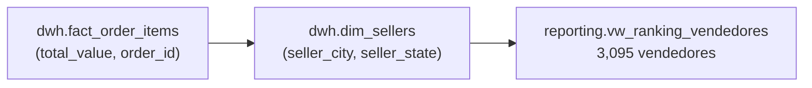

**SQL** — `CTE` + `RANK() OVER()` múltiple:
```sql
WITH metricas AS (
    SELECT ds.seller_id, ds.seller_city, ds.seller_state,
           SUM(f.total_value)         AS revenue_total,
           COUNT(DISTINCT f.order_id) AS total_ordenes
    FROM dwh.fact_order_items f
    JOIN dwh.dim_sellers ds ON f.seller_sk = ds.seller_sk
    GROUP BY ds.seller_id, ds.seller_city, ds.seller_state
)
SELECT seller_id, seller_city, seller_state,
       ROUND(revenue_total, 2),
       RANK() OVER (ORDER BY revenue_total DESC) AS ranking_revenue,
       RANK() OVER (ORDER BY total_ordenes DESC) AS ranking_ordenes
FROM metricas ORDER BY revenue_total DESC;
```

**Columnas de `reporting.vw_ranking_vendedores`:**

| Columna | Tipo | Descripción |
|---|---|---|
| `seller_id` | VARCHAR | ID único del vendedor (anonimizado) |
| `seller_city` | VARCHAR | Ciudad del vendedor |
| `seller_state` | VARCHAR | Estado brasileño del vendedor (sigla de 2 letras) |
| `revenue_total` | NUMERIC | Revenue acumulado total del vendedor (BRL) |
| `total_ordenes` | BIGINT | Cantidad de órdenes únicas atendidas |
| `ticket_promedio` | NUMERIC | Revenue promedio por ítem vendido |
| `productos_distintos` | BIGINT | Cantidad de SKUs distintos vendidos |
| `ranking_revenue` | BIGINT | Posición del vendedor por revenue total (`RANK()`) |
| `ranking_ordenes` | BIGINT | Posición del vendedor por volumen de órdenes (`RANK()`) |
| `ranking_ticket` | BIGINT | Posición del vendedor por ticket promedio (`RANK()`) |

**Visual:** Tabla Top 10 + treemap por estado.

**Ver en el Dashboard:** [Página 2 — Análisis de Vendedores y Categorías](#página-2--análisis-de-vendedores-y-categorías) · Treemap "Revenue por Estado y Ciudad" + Tabla "Revenue por Estado de los Vendedores"

<details>
<summary>📊 Datos reales — <code>reporting.vw_ranking_vendedores</code> (top 10 de 3,095 vendedores)</summary>

| Rank Rev. | Seller ID (parcial)  | Ciudad               | Estado | Revenue (BRL) | Órdenes | Ticket Prom. | Rank Órd. |
|-----------|---------------------|----------------------|--------|--------------|---------|-------------|-----------|
| 1         | 4869f7a5dfa277a7    | Guariba              | SP     | 249,640.70   | 1,132   | 215.95      | 9         |
| 2         | 7c67e1448b00f6e9    | Itaquaquecetuba      | SP     | 239,536.44   | 982     | 175.61      | 11        |
| 3         | 53243585a1d6dc26    | Lauro de Freitas     | BA     | 235,856.68   | 358     | 575.26      | 40        |
| 4         | 4a3ca9315b744ce9    | Ibitinga             | SP     | 235,539.96   | 1,806   | 118.54      | **2**     |
| 5         | fa1c13f2614d7b5c    | Sumaré               | SP     | 204,084.73   | 585     | 348.27      | 19        |
| 6         | da8622b14eb17ae2    | Piracicaba           | SP     | 185,192.32   | 1,314   | 119.40      | 5         |
| 7         | 7e93a43ef30c4f03    | Barueri              | SP     | 182,754.05   | 336     | 537.51      | 46        |
| 8         | 1025f0e2d44d7041    | São Paulo            | SP     | 172,860.69   | 915     | 121.05      | 13        |
| 9         | 7a67c85e85bb2ce8    | São Paulo            | SP     | 162,648.38   | 1,160   | 138.90      | 7         |
| 10        | 955fee9216a65b61    | São Paulo            | SP     | 160,602.68   | 1,287   | 107.14      | 6         |

> El vendedor rank #3 en revenue (Lauro de Freitas, BA) tiene ticket promedio de R$575 — muy por encima del promedio. El vendedor rank #4 en revenue tiene el **mayor volumen de órdenes** (1,806).

</details>

---

### P4 — ¿Qué estados de Brasil tienen el peor tiempo promedio de entrega?

**Por qué importa:** La logística es uno de los principales factores de satisfacción. Identificar los estados con peor desempeño prioriza mejoras en distribución.

**Tablas involucradas:**
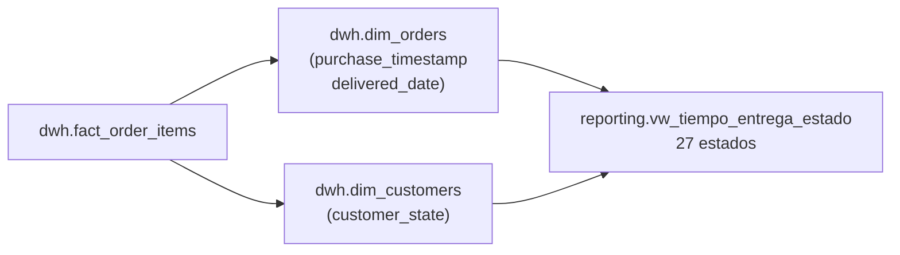

**SQL** — `CTE` + `EXTRACT(DAY)` + `RANK() OVER()`:
```sql
WITH tiempos AS (
    SELECT dc.customer_state AS estado,
           EXTRACT(DAY FROM (
               dor.order_delivered_customer_date - dor.order_purchase_timestamp
           )) AS dias_entrega
    FROM dwh.fact_order_items f
    JOIN dwh.dim_customers dc  ON f.customer_sk = dc.customer_sk
    JOIN dwh.dim_orders    dor ON f.order_sk    = dor.order_sk
    WHERE dor.order_delivered_customer_date IS NOT NULL
)
SELECT estado, ROUND(AVG(dias_entrega), 1) AS dias_promedio,
       RANK() OVER (ORDER BY AVG(dias_entrega) DESC) AS ranking_peor
FROM tiempos GROUP BY estado ORDER BY dias_promedio DESC;
```

**Columnas de `reporting.vw_tiempo_entrega_estado`:**

| Columna | Tipo | Descripción |
|---|---|---|
| `estado` | VARCHAR | Sigla del estado brasileño del cliente (ej. `SP`, `RJ`, `AM`) |
| `dias_promedio` | NUMERIC | Promedio de días entre compra y entrega efectiva |
| `entrega_minima` | NUMERIC | Tiempo mínimo de entrega registrado en el estado (días) |
| `entrega_maxima` | NUMERIC | Tiempo máximo de entrega registrado en el estado (días) |
| `total_entregas` | BIGINT | Cantidad de órdenes entregadas con fecha real registrada |
| `ranking_mejor_entrega` | BIGINT | Posición del estado: 1 = más rápido (`RANK() ASC`) |
| `ranking_peor_entrega` | BIGINT | Posición del estado: 1 = más lento (`RANK() DESC`) |

> Solo incluye órdenes con `order_delivered_customer_date IS NOT NULL` y fecha de entrega posterior a la de compra.

**Visual:** Mapa coroplético de Brasil coloreado por tiempo promedio.

**Ver en el Dashboard:** [Página 3 — Calidad del Servicio](#página-3--calidad-del-servicio--logística-y-satisfacción) · Mapa "Tiempo de Entrega por Estado" + Barras "Top 10 Estados con Peor Entrega"

<details>
<summary>📊 Datos reales — <code>reporting.vw_tiempo_entrega_estado</code> (27 estados de Brasil)</summary>

| Estado | Días Prom. | Días Mín. | Días Máx. | Entregas | Rank Peor | Rank Mejor |
|--------|-----------|-----------|-----------|---------|-----------|------------|
| AP     | **27.8**  | 5         | 187       | 81      | **1**     | 26         |
| RR     | **27.8**  | 6         | 172       | 46      | **1**     | 26         |
| AM     | 26.0      | 4         | 138       | 163     | 3         | 25         |
| AL     | 24.0      | 4         | 90        | 427     | 4         | 24         |
| PA     | 23.3      | 4         | 195       | 1,054   | 5         | 23         |
| MA     | 21.2      | 3         | 168       | 800     | 6         | 22         |
| SE     | 21.0      | 6         | 194       | 375     | 7         | 21         |
| CE     | 20.5      | 2         | 168       | 1,426   | 8         | 20         |
| AC     | 20.3      | 7         | 72        | 91      | 9         | 19         |
| PB     | 20.1      | 5         | 102       | 586     | 10        | 18         |
| RO     | 19.3      | 7         | 50        | 273     | 11        | 17         |
| PI     | 18.9      | 2         | 194       | 523     | 12        | 15         |
| RN     | 18.9      | 1         | 174       | 521     | 12        | 15         |
| BA     | 18.8      | 2         | 167       | 3,677   | 14        | 14         |
| PE     | 17.8      | 1         | 166       | 1,746   | 15        | 13         |
| MT     | 17.5      | 3         | 79        | 1,037   | 16        | 12         |
| TO     | 17.0      | 5         | 58        | 310     | 17        | 11         |
| ES     | 15.2      | 2         | 209       | 2,225   | 18        | 10         |
| MS     | 15.1      | 3         | 58        | 811     | 19        | 9          |
| GO     | 14.9      | 1         | 181       | 2,277   | 20        | 8          |
| RJ     | 14.7      | 1         | 208       | 14,145  | 21        | 6          |
| RS     | 14.7      | 1         | 186       | 6,133   | 21        | 6          |
| SC     | 14.5      | 1         | 98        | 4,098   | 23        | 5          |
| DF     | 12.5      | 1         | 68        | 2,355   | 24        | 4          |
| MG     | 11.5      | 1         | 187       | 12,917  | 25        | 2          |
| PR     | 11.5      | 1         | 97        | 5,649   | 25        | 2          |
| **SP** | **8.3**   | 1         | 191       | **46,432** | **27** | **1**   |

> **AP y RR empatan en el peor tiempo** con 27.8 días promedio. **SP** entrega en 8.3 días — una brecha de 3.3x vs el norte del país, explicada por infraestructura logística y distancia geográfica.

</details>

---

### P5 — ¿Qué categorías tienen mayor satisfacción y cómo se relaciona con el precio?

**Por qué importa:** Correlacionar satisfacción con ticket promedio revela categorías con alto precio y baja satisfacción — riesgo de churn.

**Tablas involucradas:**
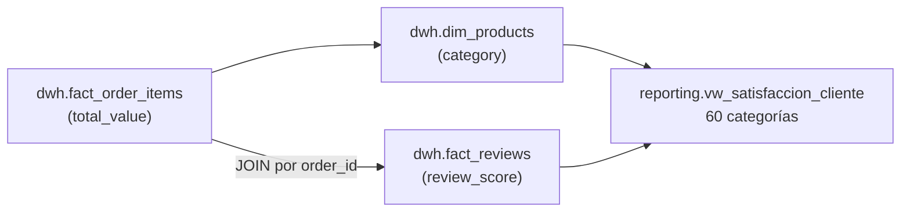

**SQL** — `CTE` + `JOIN entre fact tables` + `RANK() OVER()`:
```sql
WITH base AS (
    SELECT dp.product_category_name_english AS categoria,
           fr.review_score, f.total_value
    FROM dwh.fact_order_items f
    JOIN dwh.dim_products dp ON f.product_sk = dp.product_sk
    JOIN dwh.fact_reviews  fr ON f.order_id  = fr.order_id
    WHERE fr.review_score IS NOT NULL
)
SELECT categoria,
       ROUND(AVG(review_score), 2)                                                AS score_promedio,
       ROUND(AVG(total_value), 2)                                                 AS ticket_promedio,
       ROUND(SUM(CASE WHEN review_score >= 4 THEN 1 ELSE 0 END)::NUMERIC
             / COUNT(*) * 100, 1)                                                 AS pct_satisfaccion,
       RANK() OVER (ORDER BY AVG(review_score) DESC)                              AS ranking
FROM base GROUP BY categoria HAVING COUNT(*) >= 50
ORDER BY score_promedio DESC;
```

**Columnas de `reporting.vw_satisfaccion_cliente`:**

| Columna | Tipo | Descripción |
|---|---|---|
| `categoria` | VARCHAR | Categoría del producto en inglés (o `'Sin categoría'`) |
| `score_promedio` | NUMERIC | Promedio del `review_score` (escala 1–5) |
| `total_reviews` | BIGINT | Total de reseñas para la categoría (filtro: mínimo 50) |
| `reviews_positivas` | BIGINT | Reseñas con score ≥ 4 |
| `reviews_negativas` | BIGINT | Reseñas con score ≤ 2 |
| `pct_satisfaccion` | NUMERIC | % de reseñas positivas sobre el total |
| `ticket_promedio` | NUMERIC | Revenue promedio por ítem en la categoría (BRL) |
| `ranking_satisfaccion` | BIGINT | Posición de la categoría por score promedio (`RANK() DESC`) |

> Filtra categorías con menos de 50 reseñas (`HAVING COUNT(*) >= 50`) para evitar sesgos estadísticos. Resultado: 60 de 72 categorías totales.

**Visual:** Scatter plot — eje X: ticket promedio, eje Y: score satisfacción, tamaño burbuja: total reviews.

**Ver en el Dashboard:** [Página 3 — Calidad del Servicio](#página-3--calidad-del-servicio--logística-y-satisfacción) · Scatter "Satisfacción vs Precio por Categoría"

<details>
<summary>📊 Datos reales — <code>reporting.vw_satisfaccion_cliente</code> (top 10 y bottom 5 de 60 categorías)</summary>

**Top 10 — Mayor satisfacción:**

| Rank | Categoría                            | Score Prom. | Reseñas | % Positivas | Ticket Prom. |
|------|--------------------------------------|-------------|---------|-------------|-------------|
| 1    | books_general_interest               | 4.45        | 549     | 87.8%       | 101.47      |
| 2    | costruction_tools_tools              | 4.44        | 99      | 90.9%       | 179.11      |
| 3    | books_imported                       | 4.40        | 60      | 85.0%       | 90.16       |
| 4    | books_technical                      | 4.37        | 266     | 85.3%       | 87.58       |
| 5    | luggage_accessories                  | 4.32        | 1,088   | 83.7%       | 156.40      |
| 5    | food_drink                           | 4.32        | 279     | 81.7%       | 70.93       |
| 7    | small_appliances_home_oven_and_coffee| 4.30        | 76      | 84.2%       | 660.44      |
| 8    | fashion_shoes                        | 4.23        | 261     | 80.8%       | 108.29      |
| 9    | food                                 | 4.22        | 495     | 81.8%       | 72.75       |
| 10   | cine_photo                           | 4.21        | 73      | 78.1%       | 112.51      |

**Bottom 5 — Menor satisfacción:**

| Rank | Categoría               | Score Prom. | Reseñas | % Positivas | Ticket Prom. |
|------|------------------------|-------------|---------|-------------|-------------|
| 57   | fashio_female_clothing | 3.78        | 50      | 68.0%       | 70.72       |
| 58   | fixed_telephony        | 3.68        | 262     | 67.2%       | 242.80      |
| 59   | fashion_male_clothing  | 3.64        | 131     | 66.4%       | 97.07       |
| 60   | office_furniture       | 3.49        | 1,687   | 59.7%       | 201.83      |

> **office_furniture** tiene el peor score (3.49) con 1,687 reseñas — alto ticket promedio (R$201) y baja satisfacción sugieren problemas con la entrega de muebles voluminosos. Los libros dominan el top por expectativas claras y entrega confiable.

</details>

---

## Phase 5 — Stored Procedures PL/pgSQL

### ¿Por qué snapshots y no solo vistas?

Las vistas de Fase 4 recalculan todo en tiempo real cada vez que Power BI las consulta. Los stored procedures de Fase 5 **pre-calculan y persisten los resultados** en tablas físicas:

| | Vistas (Fase 4) | Snapshots (Fase 5) |
|---|---|---|
| Cuándo se calcula | Cada consulta | Una vez al ejecutar el SP |
| Velocidad | Depende del volumen de datos | Instantánea (ya calculado) |
| Histórico | Solo el estado actual | Guarda el estado en el momento de ejecución |
| Comparativas MoM/YoY | Requiere recalcular | Pre-calculadas y almacenadas |

### Flujo de ejecución de Fase 5

```
[1/4] Crea tablas destino     → reporting.reporte_mensual_snapshot
                                 reporting.seller_segments

[2/4] Despliega funciones     → sp_generar_reporte_mensual(año, mes)
                                 sp_segmentar_vendedores()

[3/4] Batch 2016-2018         → Llama sp_generar_reporte_mensual() 36 veces
                                 (una por cada mes del dataset)
                                 → UPSERT en reporte_mensual_snapshot

[4/4] Segmentación            → Llama sp_segmentar_vendedores() una vez
                                 → Inserta 3,095 filas en seller_segments
```

---

### `sp_generar_reporte_mensual(p_anio, p_mes)`

Genera un snapshot ejecutivo para cualquier período YYYY-MM. Calcula KPIs del mes, los compara con el mes anterior (MoM) y el mismo mes del año anterior (YoY), identifica top 3 categorías y vendedores, y hace UPSERT en `reporte_mensual_snapshot`.

**Columnas de `reporting.reporte_mensual_snapshot`:**

| Columna | Tipo | Descripción |
|---|---|---|
| `periodo` | VARCHAR(7) | Período en formato `YYYY-MM` — PK de la tabla |
| `fecha_generacion` | TIMESTAMPTZ | Cuándo se ejecutó el procedure |
| `ingresos_totales` | NUMERIC | Revenue total del mes (BRL) |
| `total_ordenes` | BIGINT | Órdenes únicas en el mes |
| `ticket_promedio` | NUMERIC | Revenue promedio por orden (= `ingresos_totales / total_ordenes`) |
| `top_categoria_1/2/3` | TEXT | Las 3 categorías con mayor revenue en el mes |
| `top_vendedor_1/2/3` | TEXT | Los 3 vendedores con mayor revenue en el mes |
| `score_satisfaccion` | NUMERIC | Promedio de review_score del mes (1–5) |

**Técnicas PL/pgSQL demostradas:**

| Técnica | Uso |
|---------|-----|
| `RAISE EXCEPTION` + `ERRCODE` | Valida que mes esté entre 1–12 |
| `RAISE NOTICE` | Log operacional en cada paso |
| `SELECT INTO` | Asigna top 3 categorías y vendedores a variables locales |
| `INSERT ... ON CONFLICT ON CONSTRAINT ... DO UPDATE` | Upsert idempotente por período |
| `GET DIAGNOSTICS ROW_COUNT` | Verifica filas afectadas tras el upsert |
| `RETURN QUERY` + CTEs con `LAG` y `CROSS JOIN` | KPIs con comparativas MoM y YoY |
| Bloque `EXCEPTION` | Re-lanza errores de validación, captura errores inesperados |

```sql
-- Consultar el reporte de agosto 2018 en tiempo real:
SELECT * FROM reporting.sp_generar_reporte_mensual(2018, 8);

-- Ver todos los snapshots persistidos:
SELECT periodo, ingresos_totales, total_ordenes, top_categoria_1, score_satisfaccion
FROM reporting.reporte_mensual_snapshot
ORDER BY periodo;
```

---

### `sp_segmentar_vendedores()`

Clasifica los 3,095 vendedores activos en 4 segmentos (A/B/C/D) usando cuartiles de revenue. Recalcula desde cero con cada ejecución (`TRUNCATE` + `INSERT`).

**Lógica de segmentación:**

| Segmento | Cuartil | Descripción | Criterio |
|---|---|---|---|
| **A** | 1 (top) | Alto rendimiento | Top 25% de revenue total |
| **B** | 2 | Medio-alto | 25%–50% de revenue total |
| **C** | 3 | Medio-bajo | 50%–75% de revenue total |
| **D** | 4 (bottom) | Bajo rendimiento | Bottom 25% de revenue total |

**Columnas de `reporting.seller_segments`:**

| Columna | Tipo | Descripción |
|---|---|---|
| `seller_id` | VARCHAR | ID del vendedor (anonimizado) |
| `ciudad` | VARCHAR | Ciudad del vendedor |
| `estado` | CHAR(2) | Estado brasileño |
| `ingresos_total` | NUMERIC | Revenue acumulado total del vendedor |
| `total_ordenes` | INTEGER | Órdenes atendidas |
| `productos_distintos` | INTEGER | SKUs distintos vendidos |
| `ticket_promedio` | NUMERIC | Revenue promedio por ítem |
| `primera_venta` | DATE | Fecha de la primera venta registrada |
| `ultima_venta` | DATE | Fecha de la última venta registrada |
| `segmento` | CHAR(1) | `A` / `B` / `C` / `D` |
| `fecha_segmentacion` | TIMESTAMPTZ | Cuándo se ejecutó la segmentación |

**Técnicas PL/pgSQL demostradas:**

| Técnica | Uso |
|---------|-----|
| `TRUNCATE` | Limpia seller_segments antes de recalcular |
| `FOR r IN (...) LOOP` | Cursor implícito — itera los 3,095 vendedores |
| `NTILE(4) OVER (ORDER BY revenue DESC)` | Divide en cuartiles: cuartil 1 = top 25% |
| `CASE WHEN` en variable | Mapea cuartil → letra (`1→A`, `2→B`, `3→C`, `4→D`) |
| `INSERT` dentro del loop | Inserta cada vendedor clasificado individualmente |
| `% 500 = 0` con `RAISE NOTICE` | Log de progreso cada 500 registros |
| `RETURN QUERY` con CTE | Retorna resumen agregado por segmento |
| `#variable_conflict use_column` | Resuelve ambigüedad entre OUT parameters y columnas de tabla |

```sql
-- Ejecutar segmentación y ver resumen por segmento:
SELECT * FROM reporting.sp_segmentar_vendedores();

-- Ver distribución de vendedores en seller_segments:
SELECT segmento, COUNT(*) AS vendedores, ROUND(AVG(ingresos_total),2) AS revenue_promedio
FROM reporting.seller_segments
GROUP BY segmento
ORDER BY segmento;

-- Ver top 10 vendedores Segmento A:
SELECT seller_id, ciudad, estado, ingresos_total, total_ordenes
FROM reporting.seller_segments
WHERE segmento = 'A'
ORDER BY ingresos_total DESC
LIMIT 10;
```

---

## EDA — Análisis Exploratorio de Datos

> **Fuente de datos:** CSVs de la **capa Bronze** (`data/raw/`) — datos crudos sin transformar, antes del pipeline ETL.
> Los números del EDA son independientes del DWH: el EDA suma solo `price` de los ítems, mientras que las vistas de Aurora suman `price + freight_value`. Ambas perspectivas son complementarias.

**Archivo:** [`notebooks/01_EDA_Olist_Ecommerce.ipynb`](notebooks/01_EDA_Olist_Ecommerce.ipynb)

### KPIs reales extraídos del EDA (capa Bronze)

| Métrica | Valor | Nota |
|---|---|---|
| Órdenes totales | 99,441 | Período Sep 2016 – Oct 2018 |
| Clientes únicos | 96,096 | Excluye duplicados por `customer_unique_id` |
| Revenue total (precio) | R$ 13,591,644 | Solo `price`, sin freight |
| Ticket promedio por orden | R$ 137.75 | Revenue / órdenes únicas |
| Score de satisfacción | 4.09 / 5.0 | Promedio de 99,224 reseñas |
| Reseñas positivas (4–5★) | 57.8% | Alta polarización: 11.5% dan 1★ |
| Días promedio de entrega | 12.1 días | Solo órdenes con fecha real de entrega |
| Puntualidad | 91.9% | Llegaron antes de la fecha estimada |

> **Diferencia con las vistas del DWH:** `vw_revenue_mensual` muestra ~R$15.8M porque incluye `freight_value` en `total_value`. El EDA muestra R$13.6M porque solo suma el precio del producto. Ambos son correctos — miden cosas distintas.

### Estructura del Notebook (12 secciones)

| # | Sección | Técnica principal | Hallazgo clave |
|---|---------|-------------------|----------------|
| 1 | Setup e Importaciones | pandas, matplotlib, seaborn | Paleta corporativa + estilo unificado |
| 2 | Carga de Datos | `read_csv` + `parse_dates` | 8 datasets, 0 duplicados |
| 3 | Calidad de Datos | `isnull().mean()` por columna | Reviews: 21% nulos en comentarios (campo opcional) |
| 4 | Análisis Temporal | `dt.to_period('M')` + `fill_between` | Pico Nov-2017 (+53% MoM) — Black Friday Brasil |
| 5 | Revenue y Tickets | `boxplot` por ítems, histograma | Distribución sesgada: mediana R$109, media R$137 |
| 6 | Geografía | `barh` por estado | SP = 42% de las órdenes, top 3 estados = 60% revenue |
| 7 | Categorías (Pareto) | `cumsum` + eje doble | 15 categorías = 80% del revenue |
| 8 | Métodos de Pago | Donut chart, distribución de cuotas | Crédito = 73% del revenue, promedio 3.8 cuotas |
| 9 | Tiempos de Entrega | `dt.days`, histograma, ranking | AP/RR = 27.8 días vs SP = 8.3 días (brecha 3.3x) |
| 10 | Satisfacción | Score vs días de entrega, top/bottom | 4.4★ en ≤7 días vs 2.6★ en >30 días |
| 11 | Vendedores | Curva de Lorenz, log distribution | Top 5% vendedores = 50% del revenue |
| 12 | Conclusiones | Matriz Impacto vs Esfuerzo | 5 recomendaciones priorizadas para el negocio |

### Hallazgos de alto nivel

**Crecimiento:**
El marketplace creció >200% en 18 meses (Sep 2016 → Oct 2018), impulsado por eventos estacionales. El pico de noviembre 2017 (+53% MoM) confirma la sensibilidad al Black Friday brasileño como palanca de demanda.

**Pareto en Categorías:**
15 de 72 categorías concentran el 80% del revenue. El long tail (57 categorías) genera solo el 20% restante — señal de que el catálogo puede optimizarse priorizando las categorías líderes.

**Logística como Driver de NPS:**
La correlación entre tiempo de entrega y score de satisfacción es la más fuerte del dataset. Reducir los tiempos de entrega en el norte/nordeste (actualmente 2-3x el promedio nacional) es la iniciativa con mayor impacto potencial en retención.

**Concentración de Vendedores:**
La Curva de Lorenz confirma una distribución altamente inequitativa: el 5% superior de vendedores genera el 50% del GMV. Un programa de fidelización para el segmento A (implementado en `sp_segmentar_vendedores()`) tiene retorno inmediato.

### Conexión EDA → Pipeline → Power BI

```
Bronze (CSVs)          Silver (staging)        Gold (DWH)            BI
──────────────         ────────────────         ──────────           ──────
EDA valida que:        Tipos TEXT → sin         star schema           5 vistas
• 99,441 órdenes  →    errores de carga    →    tipado + FKs    →    en reporting
• 3,095 vendedores     NULLIF pattern           surrogate keys        Power BI
• 72 categorías        sin transformar          dim + fact tables     DirectQuery
```

Los hallazgos del EDA justifican cada decisión del modelo:
- La distribución temporal irregular → `generate_series()` para `dim_date` sin huecos
- Los campos vacíos en timestamps → patrón `NULLIF(col, '')::TIMESTAMP`
- La concentración de vendedores → `sp_segmentar_vendedores()` con NTILE(4)
- Las 5 preguntas de negocio → 5 vistas en `schema reporting`

---

## Hallazgos Principales

> Insights descubiertos a partir del pipeline completo (DWH en Aurora) y el EDA sobre la capa Bronze (Sep 2016 – Oct 2018).

### Revenue y Crecimiento
- El negocio escaló de **R$354 en septiembre 2016** a más de **R$1.1M mensuales en 2018** — crecimiento de >200% en 18 meses, impulsado por expansión orgánica del marketplace.
- El mayor pico ocurrió en **noviembre 2017** con un crecimiento del **+53.27% MoM** (R$1,179,143.77) — Black Friday Brasil como palanca de demanda principal.
- Los últimos meses del dataset (septiembre–octubre 2018) muestran caída abrupta: datos truncados, no representan el cierre del año.

### Categorías de Productos (Pareto)
- **Solo 15 de 72 categorías** concentran el 80% del revenue total — principio de Pareto validado con precisión.
- **health_beauty** lidera con **R$1,441,248** en revenue (9.1% del total), seguida de **watches_gifts** (R$1,305,542) y **bed_bath_table** (R$1,241,682).
- El **long tail** de 57 categorías restantes genera solo el 20% del revenue — señal de concentración de catálogo.
- Categorías como **fashion_male_clothing** y **fixed_telephony** tienen presencia en órdenes pero ticket promedio bajo.

### Vendedores
- El **top 5% de vendedores genera el 50% del revenue total** — Curva de Lorenz con alto coeficiente de Gini, típico de marketplaces en etapa de crecimiento.
- ~60% de los vendedores tienen **menos de 10 órdenes** en 2 años — perfil mayoritariamente casual.
- Los vendedores de **São Paulo (SP)** dominan el revenue por su ventaja logística y acceso al mayor mercado de Brasil.

### Logística
- **Brecha de 3.3x** entre los estados más lentos y SP: AP y RR promedian **27.8 días** de entrega vs **8.3 días** en SP.
- Los estados del norte (AP, RR, AM) superan los 25 días promedio — la mayor brecha logística del país.
- Los estados del sureste (**SP, PR, SC, MG**) lideran en eficiencia logística, reforzando la ventaja competitiva de los vendedores ubicados allí.

### Satisfacción del Cliente
- **books_general_interest** lidera con **4.45 / 5.0** (549 reseñas, 87.8% positivas) — expectativas claras y entregas confiables explican el top ranking.
- **office_furniture** tiene el peor score: **3.49 / 5.0** con 1,687 reseñas (59.7% positivas) — el volumen y peso de los productos dificultan la logística.
- **Correlación inversa confirmada:** 4.4★ en entregas ≤7 días vs 2.6★ en entregas >30 días — la puntualidad logística es el principal driver de NPS.

---

## Estructura del Repositorio

```
.
├── config/
│   └── settings.py                      # Carga y valida todas las env vars
├── scripts/
│   ├── utils/
│   │   └── logger.py                    # Logger centralizado (consola + archivo)
│   ├── phase1_extract/
│   │   ├── kaggle_extractor.py          # Descarga y extrae el dataset
│   │   ├── s3_uploader.py               # Sube CSVs a S3 con SSE-AES256
│   │   └── main.py
│   ├── phase2_aurora_ingestion/
│   │   ├── iam_setup.py                 # Adjunta LabRole a Aurora
│   │   ├── aurora_loader.py             # Ejecuta SQL via psycopg2
│   │   └── main.py
│   ├── phase3_star_schema/
│   │   ├── star_schema_builder.py
│   │   └── main.py
│   ├── phase4_bi_queries/
│   │   ├── reporting_builder.py         # Crea vistas en schema reporting
│   │   └── main.py
│   ├── phase5_procedures/
│   │   ├── procedure_runner.py          # Ejecuta stored procedures via psycopg2
│   │   └── main.py
│   └── test_connections.py              # Diagnóstico de conexiones
├── sql/
│   ├── phase2_aurora_ingestion/
│   │   ├── 01_enable_extension.sql
│   │   ├── 02_create_staging_tables.sql
│   │   ├── 03_load_from_s3.sql
│   │   └── 04_verify_counts.sql
│   ├── phase3_star_schema/
│   │   ├── 01_create_dwh_schema.sql
│   │   ├── 02_populate_dimensions.sql
│   │   ├── 03_populate_facts.sql
│   │   └── 04_data_quality_tests.sql
│   ├── phase4_bi_queries/
│   │   ├── 01_create_reporting_views.sql
│   │   └── 02_validate_views.sql
│   └── phase5_procedures/
│       ├── 01_create_support_tables.sql # Tablas snapshot para los procedures
│       ├── 02_sp_generar_reporte_mensual.sql  # KPIs mensuales + MoM + YoY
│       ├── 03_sp_segmentar_vendedores.sql     # Segmentación A/B/C/D por NTILE
│       └── 04_test_procedures.sql
├── notebooks/
│   └── 01_EDA_Olist_Ecommerce.ipynb    # EDA completo — 12 secciones, 10 visualizaciones
├── powerbi/
│   ├── Tablero_Ejecutivo_DWH.pbix       # Tablero Power BI (archivo fuente)
│   ├── Tablero_Ejecutivo_DWH.pdf        # Exportación PDF del tablero
│   └── screenshots/
│       ├── dashboard_p01.png            # Vista previa página 1
│       ├── dashboard_p02.png            # Vista previa página 2
│       └── dashboard_p03.png            # Vista previa página 3
├── .env.example
├── .gitignore
└── requirements.txt
```

---

## Cómo Ejecutar el Proyecto

### 1. Prerrequisitos

- Python 3.10+
- Cuenta de [Kaggle](https://www.kaggle.com/) con Legacy API Key
- Cuenta de AWS con bucket S3 y cluster Aurora PostgreSQL
- Git

### 2. Setup inicial

```bash
git clone https://github.com/KevinAstudillo/Modulo-4-Olist-e2e-data-pipeline-in-AWS.git
cd Modulo-4-Olist-e2e-data-pipeline-in-AWS
python -m venv Proyecto_Final_Mod_4
Proyecto_Final_Mod_4\Scripts\activate   # Windows
pip install -r requirements.txt
copy .env.example .env                  # completar con credenciales reales
```

### 3. Validar conexiones

```bash
python -m scripts.test_connections
```

### 4. Ejecutar el pipeline completo

```bash
python -m scripts.phase1_extract.main           # Kaggle → S3 Bronze
python -m scripts.phase2_aurora_ingestion.main  # S3 → Aurora staging
python -m scripts.phase3_star_schema.main       # staging → dwh Star Schema
python -m scripts.phase4_bi_queries.main        # dwh → reporting views
python -m scripts.phase5_procedures.main        # Stored Procedures + snapshots
```

### 5. Correr los tests

```bash
# Tests unitarios — no requieren AWS ni Aurora (siempre disponibles)
pytest -m unit

# Tests de integración — requieren Aurora activo y .env configurado
pytest -m integration

# Suite completa
pytest
```

### 6. Abrir el EDA Notebook

```bash
jupyter notebook notebooks/01_EDA_Olist_Ecommerce.ipynb
```

---

## Testing

El proyecto incluye una suite de **81 tests** organizados en dos niveles:

### Arquitectura de tests

```
tests/
├── conftest.py                    # Fixture de conexión Aurora (session-scoped)
├── test_config.py                 # Unit: carga y validación de configuración
├── test_sql_files.py              # Unit: integridad de los 14 scripts SQL
├── phase3/test_star_schema.py     # Integration: Star Schema en Aurora
├── phase4/test_reporting_views.py # Integration: 5 vistas de reporting
└── phase5/test_procedures.py      # Integration: snapshots y segmentación
```

### Tests unitarios — `pytest -m unit` (38 tests, sin AWS)

| Archivo | Tests | Qué verifica |
|---|---|---|
| `test_config.py` | 5 | Config carga correctamente, vars requeridas fallan con `OSError`, defaults, `frozen=True` |
| `test_sql_files.py` | 33 | Los 14 scripts SQL existen y no están vacíos, `DROP TABLE CASCADE` presente, `order_sk` definido en ambas fact tables |

### Tests de integración — `pytest -m integration` (43 tests, requieren Aurora)

| Archivo | Tests | Qué verifica |
|---|---|---|
| `phase3/test_star_schema.py` | 9 | Row counts exactos de las 8 tablas DWH, cero NULLs en FKs de `fact_order_items`, cobertura ≥99% de `order_sk` en `fact_payments`/`fact_reviews`, integridad `order_id↔order_sk`, precios positivos, scores 1-5, calendario sin huecos |
| `phase4/test_reporting_views.py` | 13 | Row counts de las 5 vistas, spot-checks contra datos del README (Nov-2017 es el pico, SP entrega en ~8.3 días, `health_beauty` rank 1, curva de Pareto monótona, `office_furniture` peor satisfacción) |
| `phase5/test_procedures.py` | 10 | `reporte_mensual_snapshot` con ≥20 períodos en formato `YYYY-MM`, Nov-2017 como pico en snapshot, `seller_segments` con 3,095 vendedores en segmentos A/B/C/D con distribución 20-30% cada uno |

> Los tests de integración usan una fixture `db_conn` con scope de sesión — una sola conexión para todos los tests. Si `AURORA_HOST` no está en el `.env`, se saltan automáticamente con `SKIP`.

### Resultado de la suite completa

```
========================= 81 passed in 11.49s =========================
```

---

## Resultados de Calidad de Datos

| Test | Resultado |
|---|---|
| FKs nulas en `fact_order_items` | 0 — PASS |
| `order_sk` resuelto en `fact_payments` | 100% — PASS |
| `order_sk` resuelto en `fact_reviews` | 100% — PASS |
| Precios negativos | 0 — PASS |
| Review scores fuera de rango 1-5 | 0 — PASS |
| IDs duplicados en dimensiones | 0 — PASS |
| Huecos en `dim_date` | 0 — PASS |

---

## Dashboard Power BI — Vista Previa

El tablero tiene **3 páginas** conectadas directamente a las 5 vistas del schema `reporting` en Aurora PostgreSQL via DirectQuery. Cada página responde preguntas de negocio específicas.

| Página | Título | Preguntas que responde | Vista SQL usada |
|--------|--------|----------------------|-----------------|
| 1 | Executive Summary | P1 — Revenue mensual y crecimiento MoM | `vw_revenue_mensual` |
| 1 | Executive Summary | P2 — Top categorías por revenue | `vw_top_categorias_pareto` |
| 2 | Análisis de Vendedores y Categorías | P2 — Curva de Pareto acumulada | `vw_top_categorias_pareto` |
| 2 | Análisis de Vendedores y Categorías | P3 — Ranking de vendedores | `vw_ranking_vendedores` |
| 3 | Calidad del Servicio | P4 — Tiempos de entrega por estado | `vw_tiempo_entrega_estado` |
| 3 | Calidad del Servicio | P5 — Satisfacción vs precio por categoría | `vw_satisfaccion_cliente` |

---

### Página 1 — Executive Summary
> Responde **P1** (¿Cómo evolucionó el revenue?) y **P2** (¿Qué categorías lideran?)
>
> KPIs globales · Línea de revenue mensual · % Crecimiento MoM · Barras de top categorías · Slicer por año y mes

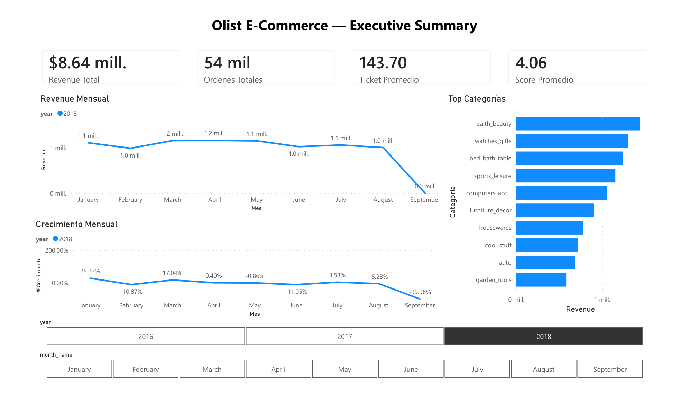

---

### Página 2 — Análisis de Vendedores y Categorías
> Responde **P2** (Pareto de categorías) y **P3** (¿Cuáles son los top vendedores?)
>
> Treemap revenue por estado · Curva de Pareto acumulada · Tabla ranking de vendedores con revenue, órdenes y ciudad · Filtros por estado y categoría

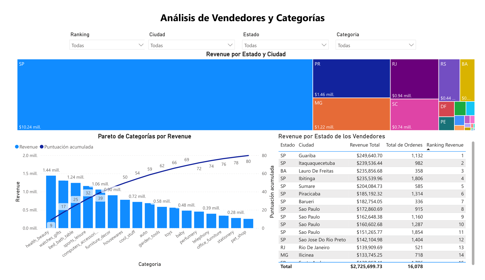

---

### Página 3 — Calidad del Servicio — Logística y Satisfacción
> Responde **P4** (¿Qué estados tienen peor entrega?) y **P5** (¿Satisfacción vs precio?)
>
> Mapa coroplético de entrega por estado · Top 10 estados con peor desempeño logístico · Scatter plot satisfacción vs ticket promedio por categoría · KPIs: días promedio de entrega y score de satisfacción

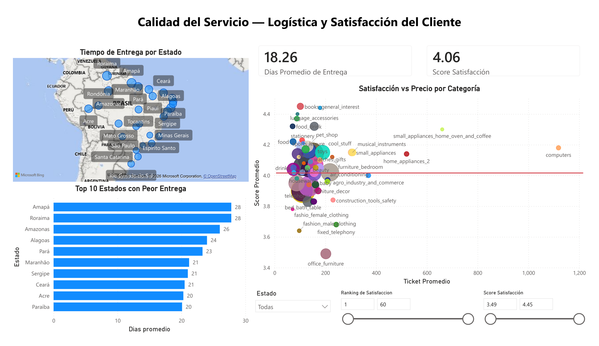

> **Archivo fuente:** [`powerbi/Tablero_Ejecutivo_DWH.pbix`](powerbi/Tablero_Ejecutivo_DWH.pbix) — requiere Power BI Desktop y credenciales de Aurora.

---

## Estado del Proyecto

| Fase | Estado | Descripción |
|---|---|---|
| 1 — Bronze Ingestion | ✅ Completa | Kaggle → S3 (CSV crudo, ~45MB) |
| 2 — Aurora Staging | ✅ Completa | S3 → Aurora via `aws_s3`, schema `staging` |
| 3 — Star Schema DWH | ✅ Completa | 5 dims + 3 facts, 15 tests de calidad |
| 4 — Reporting Layer | ✅ Completa | 5 vistas SQL avanzadas en schema `reporting` |
| 5 — Stored Procedures | ✅ Completa | 2 PL/pgSQL functions: snapshots mensuales + segmentación A/B/C/D |
| 6 — Power BI | ✅ Completa | Dashboard v1 conectado a `reporting.*`, exportado en PDF |
| EDA Notebook | ✅ Completa | Análisis exploratorio — 12 secciones, 10 visualizaciones |

---

## Tecnologías

`Python 3.11` · `boto3` · `psycopg2` · `kaggle` · `python-dotenv` · `AWS S3` · `AWS Aurora PostgreSQL 17` · `SQL` · `PL/pgSQL` · `Jupyter` · `ipykernel` · `pandas` · `matplotlib` · `seaborn` · `numpy` · `Power BI` · `DAX`
