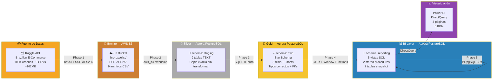
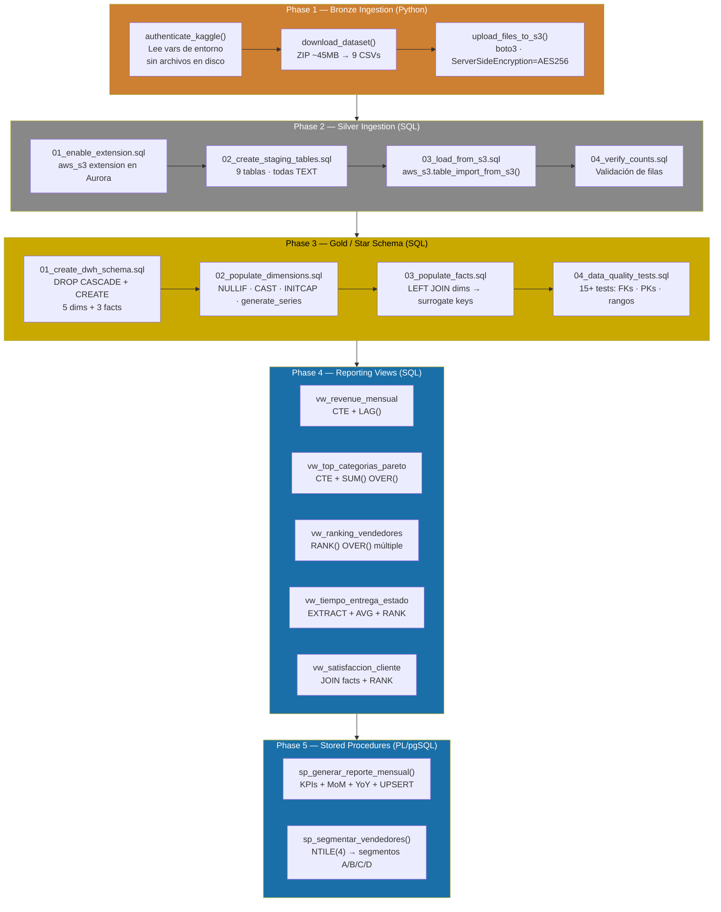
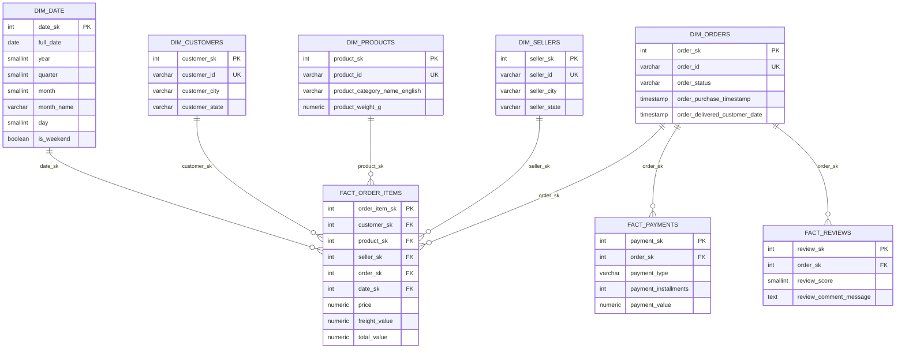
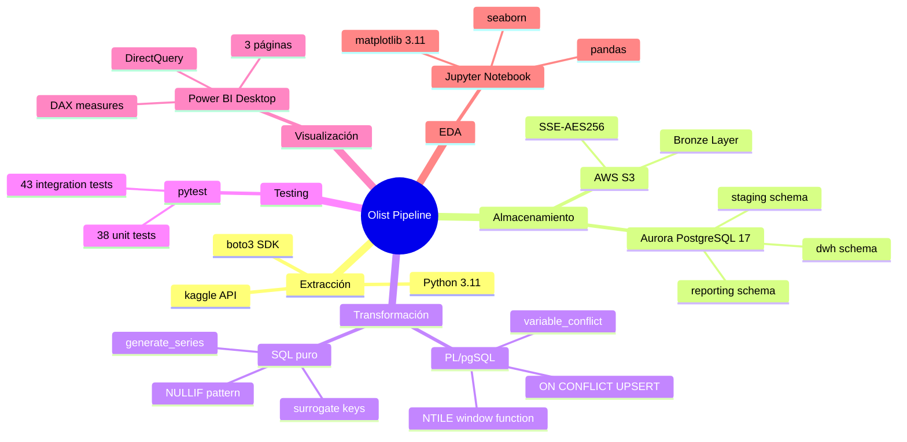

# Arquitectura del Pipeline — Olist E2E Data Pipeline en AWS

## Visión General

Pipeline de datos end-to-end sobre el dataset público de Olist (Brazilian E-Commerce), construido sobre AWS siguiendo la arquitectura **Medallion** (Bronze → Silver → Gold → BI).

---

## Diagrama de Arquitectura General



---

## Arquitectura Medallion por Capas

| Capa | Tecnología | Schema | Responsabilidad |
|---|---|---|---|
| **Ingesta** | Python + Kaggle API | — | Descarga y descompresión de CSVs |
| **Bronze** | AWS S3 + SSE-AES256 | `bronze/olist/` | Datos crudos inmutables, cifrados en reposo |
| **Silver** | Aurora PostgreSQL | `staging` | Copia fiel en BD, todo TEXT, sin transformar |
| **Gold** | Aurora PostgreSQL | `dwh` | Star Schema tipado, surrogate keys, FKs formales |
| **BI** | Aurora PostgreSQL | `reporting` | Vistas pre-calculadas + snapshots para BI |
| **Visualización** | Power BI Desktop | — | Dashboards DirectQuery sobre `reporting.*` |

---

## Flujo de Datos Detallado



---

## Modelo Dimensional — Star Schema



---

## Stack Tecnológico



---

## Decisiones de Arquitectura Clave

### 1. Staging con tipos TEXT
Todos los CSVs se cargan primero como TEXT en `staging`. Los CSVs de Kaggle contienen strings vacíos donde debería haber NULL. Cargar como TEXT permite detectar y limpiar estos errores en SQL antes de castear a los tipos finales.

### 2. Surrogate Keys (SERIAL) en todas las dimensiones
Los JOINs entre INTEGER son hasta 3x más rápidos que entre VARCHAR en tablas de millones de filas. El `order_id` VARCHAR original se conserva en todas las tablas para trazabilidad y debugging.

### 3. `fact_payments` y `fact_reviews` con FK formal a `dim_orders`
Ambas tablas tienen `order_sk INTEGER REFERENCES dim_orders(order_sk)` resuelto en el ETL mediante `LEFT JOIN dwh.dim_orders ON order_id`. El `order_id` VARCHAR se preserva para verificación:

```sql
-- Test de integridad (debe retornar 0):
SELECT COUNT(*) FROM dwh.fact_payments fp
JOIN dwh.dim_orders dor ON fp.order_sk = dor.order_sk
WHERE fp.order_id <> dor.order_id;
```

### 4. `dim_date` generada con `generate_series`
En lugar de copiar solo los días con ventas, se genera el calendario completo desde la fecha mínima a la máxima. Esto habilita análisis de días sin ventas y gaps en el negocio.

### 5. Schema `reporting` separado del DWH
La lógica de negocio queda en vistas SQL versionadas en Git. Power BI solo lee de `reporting.*`, nunca toca el DWH directamente. Las vistas se pueden recrear en segundos si el modelo cambia.

### 6. `#variable_conflict use_column` en stored procedures
Los stored procedures usan `RETURNS TABLE` con columnas que comparten nombre con columnas de las tablas que consultan. La directiva `#variable_conflict use_column` resuelve la ambigüedad a favor de las columnas de tabla.

---

## Seguridad

| Decisión | Implementación |
|---|---|
| Sin credenciales en código | `python-dotenv` + `.env` excluido de git |
| Datos cifrados en S3 | `ServerSideEncryption: AES256` en cada upload |
| Credenciales AWS temporales | `AWS_SESSION_TOKEN` rotado cada 4h (AWS Academy) |
| IAM Role para Aurora↔S3 | `LabRole` adjuntado via `iam_setup.py` |
| Datos raw excluidos de git | `data/` en `.gitignore` — solo vive en S3 y local |

---

## Métricas del Pipeline

| Componente | Cantidad |
|---|---|
| Archivos Python | 15 scripts (~1,000 líneas) |
| Scripts SQL | 14 archivos (~3,000 líneas) |
| Tablas en Aurora | 17 (9 staging + 5 dims + 3 facts) |
| Vistas de reporting | 5 |
| Stored Procedures | 2 (PL/pgSQL) |
| Tests automatizados | 81 (38 unit + 43 integration) |
| Páginas Power BI | 3 |
| Secciones EDA Notebook | 12 |
| Datos procesados | ~162MB (9 CSVs) |
| Registros en DWH | ~515,000 filas totales |
